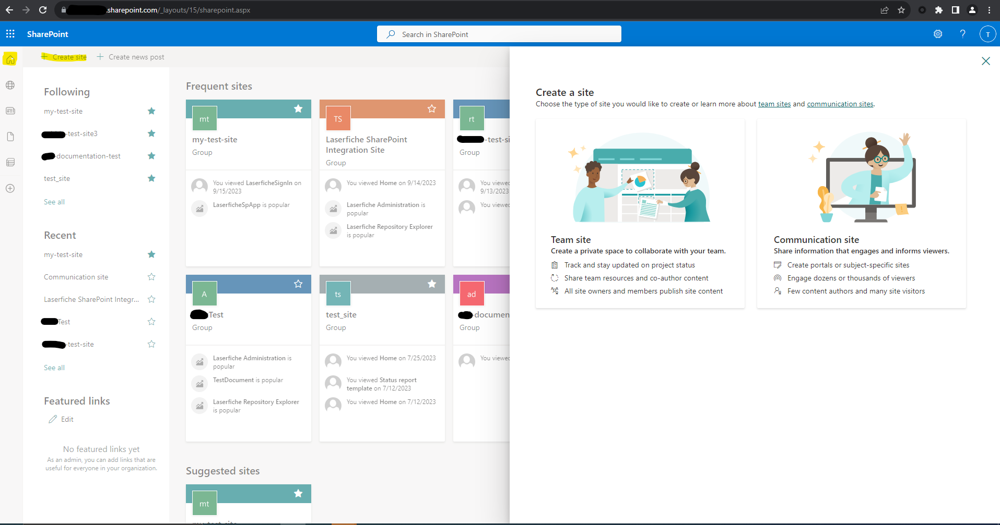

# Add App to Organization

## PRE-RELEASE DOCUMENTATION - SUBJECT TO CHANGE

### Prerequisites
  - Have a SharePoint Online account with administrator privileges for the tenant app catalog.
  - Download the latest Laserfiche SharePoint Integration [package](../assets/laserfiche-sharepoint-integration.sppkg)

### Steps
1. Navigate to the following url: https://<b>{your-full-subdomain.and-domain.com}</b>/sites/appcatalog/AppCatalog/Forms/AllItems.aspx, where the part in curly braces is replaced by the domain and subdomain of your SharePoint-related websites.
1. If you can see the "+New" and "Upload" buttons, then proceed to the next step. If not, ask an administrator to [add you as an admin to the SharePoint Online App Catalog](https://learn.microsoft.com/en-us/office365/customlearning/addappadmin#add-an-administrator).
1. Click Upload and select the Laserfiche SharePoint package file (.sppkg).

1. Click on the Deploy button when prompted to trust the solution.

1. Create a new SharePoint site by going to the Home Page and selecting the Create Site button

1. Choose Team Site or Communication Site according to your preference and finish initializing the site.
1. In your newly created site, Navigate to the app catalog by clicking on the "Site Contents" item in the
navigation bar.

1. Open the "New" Dropdown menu by clicking on the "+" icon.

1. Add the App named “laserfiche-sharepoint-integration-client-side-solution”.

1. Enable the app if you are asked to do so.
1. Navigate to your SharePoint site. On successful installation "Laserfiche SharePoint Integration" app is listed under the “Site Contents” tab.

