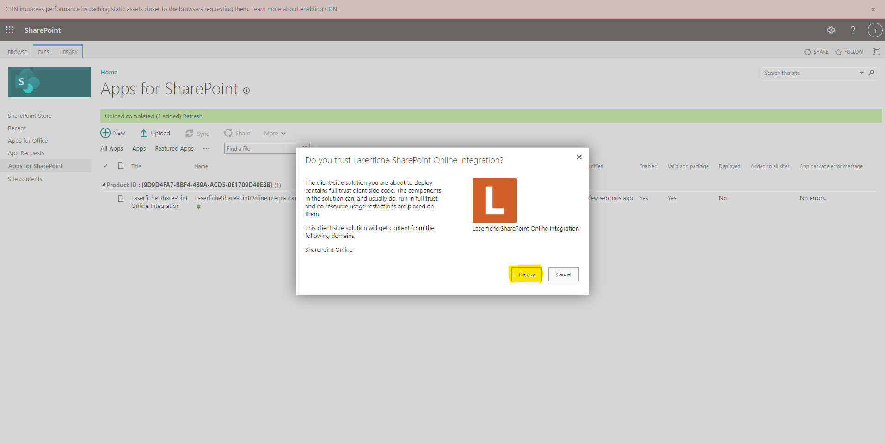

# Adding App to Organization

### Prerequisites

- Have a SharePoint Online account with administrator privileges for the tenant app catalog.
- Download the latest Laserfiche SharePoint Integration [package](../assets/LaserficheSharePointOnlineIntegration.sppkg)

### Steps

1. Navigate to the following url: <https://<b>{your-full-subdomain.and-domain.com}</b>/sites/appcatalog/AppCatalog/Forms/AllItems.aspx>, where the part in curly braces is replaced by the domain and subdomain of your SharePoint-related websites.
1. If you can see the "+New" and "Upload" buttons, then proceed to the next step. If not, ask an administrator to [add you as an admin to the SharePoint Online App Catalog](https://learn.microsoft.com/en-us/office365/customlearning/addappadmin#add-an-administrator).
1. Click Upload and select the Laserfiche SharePoint package file (.sppkg).
   
1. Click on the Deploy button when prompted to trust the solution.
   

### Next Steps

Follow the steps for [Adding App to SharePoint Site](./adding-app-to-sp-site)
