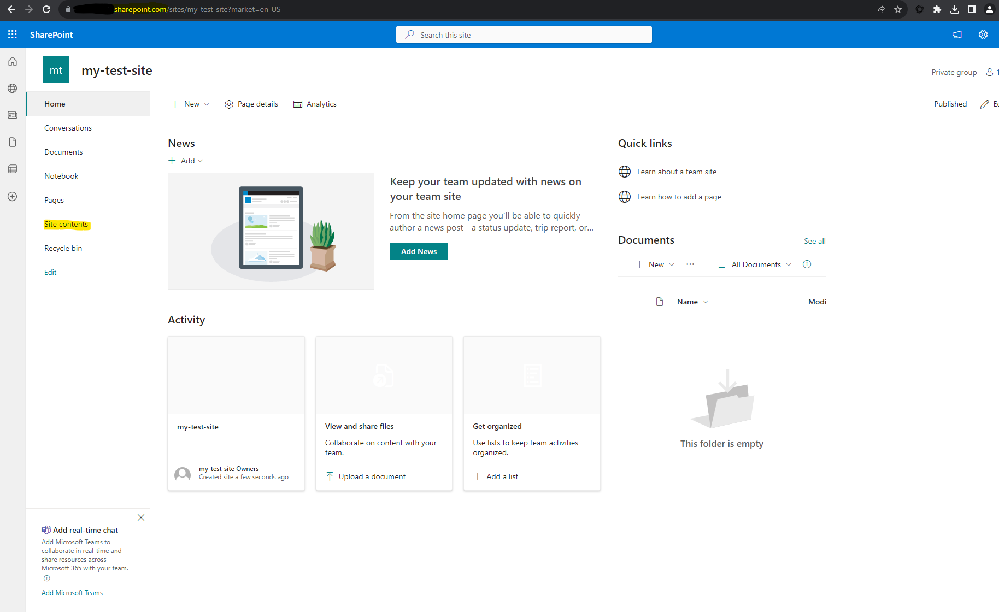
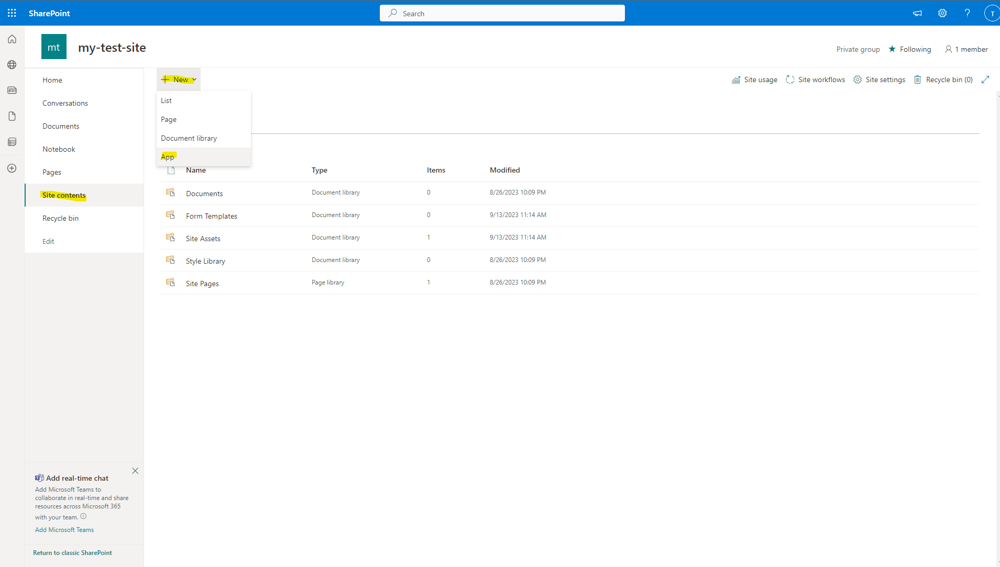
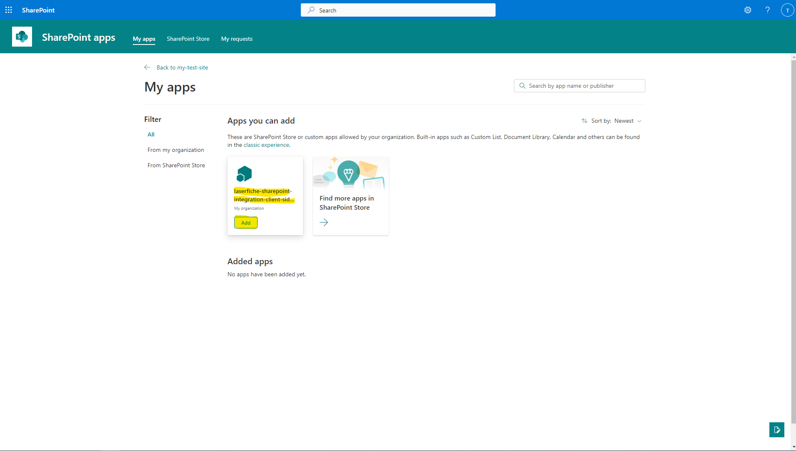
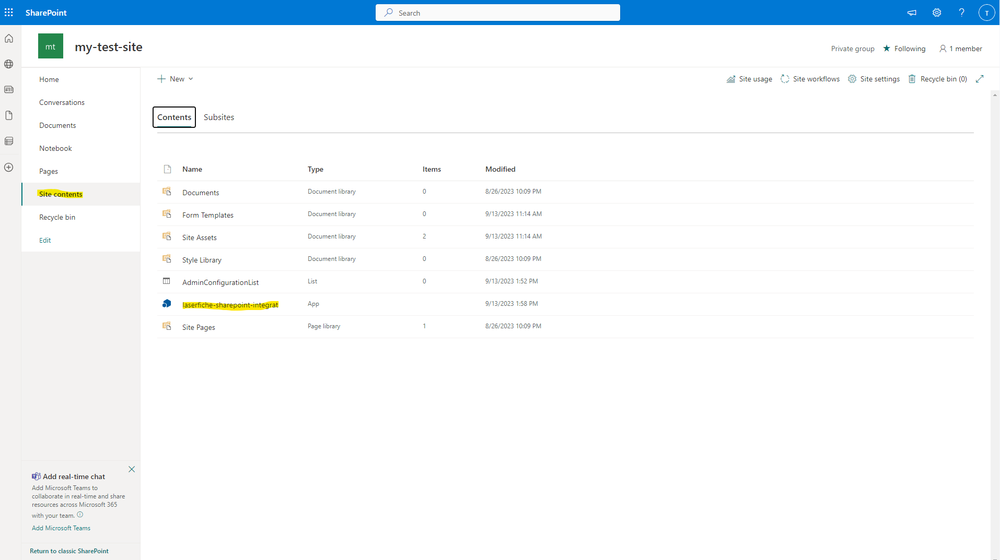
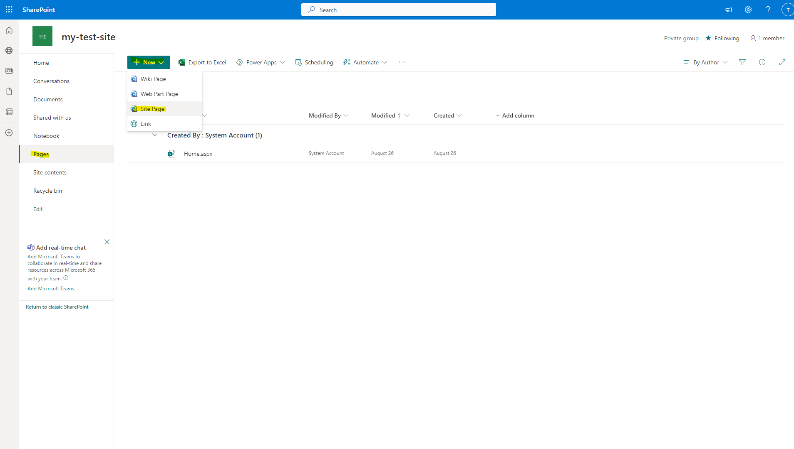
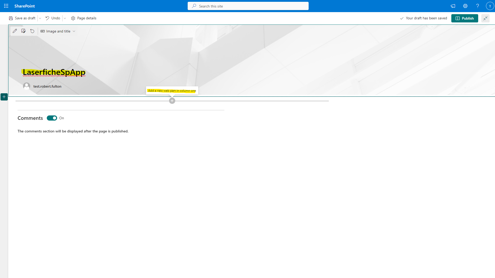
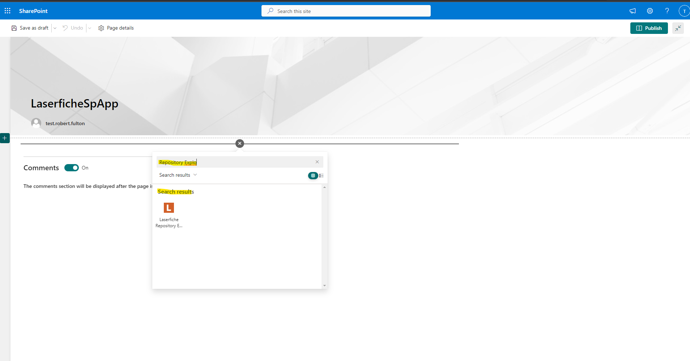

# Adding App to SharePoint Site

### Prerequisites

- Be an owner of a SharePoint site you want to add the integration to.
- The site must exist in an organization which has the integration installed. (see [Adding App to Organization](./adding-app-organization))

### Steps

1. Go to the SharePoint site that you would like to install the integration on. If you do not have a SharePoint site already, you can find instructions [here](https://support.microsoft.com/en-gb/office/create-a-site-in-sharepoint-4d1e11bf-8ddc-499d-b889-2b48d10b1ce8) on how to create one.
1. Navigate to the app catalog by clicking on the "Site contents" item in the
   navigation bar.
   
1. Open the "New" Dropdown menu by clicking on the "+" icon.
   
1. Add the App named “Laserfiche SharePoint Online Integration”.
   
1. Navigate to your SharePoint site. If successfully installed, the app will be listed under the “Site contents” tab.
   

### The Laserfiche Sign In Page

1. In your SharePoint site, select the "Pages" item in the navigation bar on the left side of the page.
   
1. Create and open a new site page by clicking the "+ New" button and selecting "Site Page" from the dropdown.
1. Title the page “LaserficheSignIn”.
1. Move your cursor just below the title area to the white space beneath. This should reveal a hidden "+" button. If you hover over it, it should display the message "Add a new web part in column one”.
   
1. Click on that button and Search for “Laserfiche Sign In".
   
1. Click on the search result with a white L on an orange square. The Laserfiche Sign In web part should now appear on your Page. Before creating subsequent pages, make sure to click the 'Publish' button to save the page.

### The Repository Explorer Page

Follow the same steps as above, but title the Page whatever you wish and add the “Repository Explorer” web part.

### The Admin Configuration Page

Follow the same steps as above, but title the page whatever you wish and add the “Admin Configuration” web part instead of “Laserfiche Sign In".

### Next Steps

Before you can log in and use the web pages you just created, you will need to [Register them in the Laserfiche Developer Console](../admin-documentation/register-app-in-laserfiche). After you register your Apps, you should be able to log in and use the web parts. For Documentation on how to use the integration, reference the [User Documentation](../user-documentation/).
