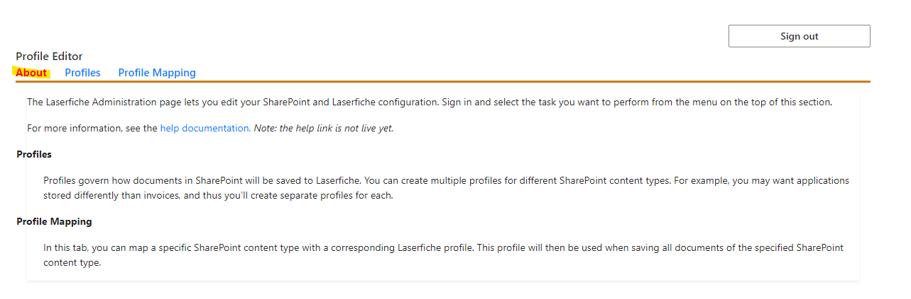
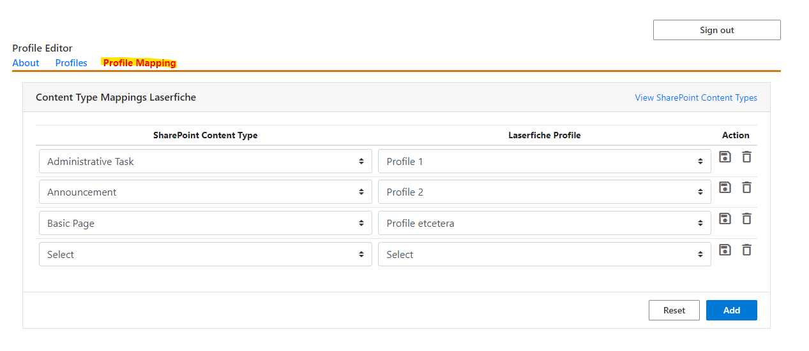
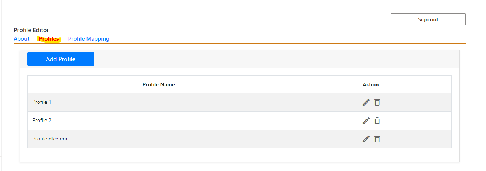
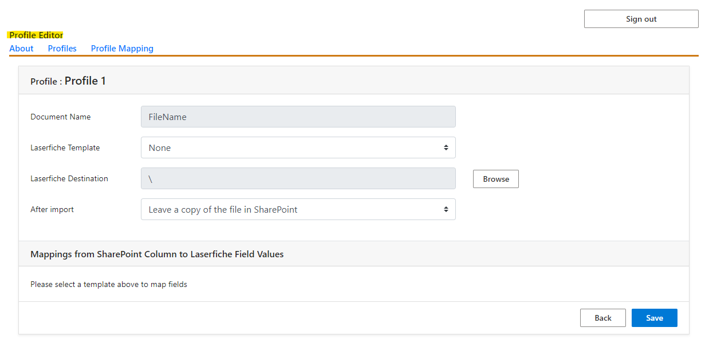

# Configure App in SharePoint

## PRE-RELEASE DOCUMENTATION - SUBJECT TO CHANGE

### Prerequisites
- be a Site Owner of the SharePoint Site for which the integration will be configured
### About Tab
Provides information about the Web Part.

### Profiles Mapping Tab
Displays a list of SharePoint Content Types and their corresponding Laserfiche Profile. If you add a content type/profile pair, then
any SharePoint content matching that type will be assigned the corresponding profile when you attempt to save the content to Laserfiche.

### Profiles Tab
Displays the list of currently defined Profiles. Click on the “Add Profile” button, or on the pencil icon to open the [Profile Editor](#profile-editor) to add a new profile or edit an existing profile, respectively.

## Profile Editor

- Name: this is the identifier used to associate SharePoint content types with this profile in the Profile Mapping tab.
- Laserfiche Template: If a profile is assigned a template, then all files saved to Laserfiche through that profile will be assigned that template in Laserfiche. [Learn more about templates](https://doc.laserfiche.com/laserfiche.documentation/en-us/Content/Fields_and_Templates.html).
- After Import: This option specifies what to do with the
SharePoint file after exporting it to Laserfiche.
- Mappings from SharePoint Column to Laserfiche Field Values
    - This is where the actual metadata transfer is configured.
    - Each Field in the template can be assigned a SharePoint column, so that when files are exported from SharePoint to Laserfiche, the file in Laserfiche will have a field with the same value as the Column of the file in SharePoint.
    - templates with required fields MUST have columns assigned to them.
    - The association between SharePoint columns and Laserfiche fields should be one-to-one, i.e., you should not attempt to map multiple SharePoint columns to the same Laserfiche field.
