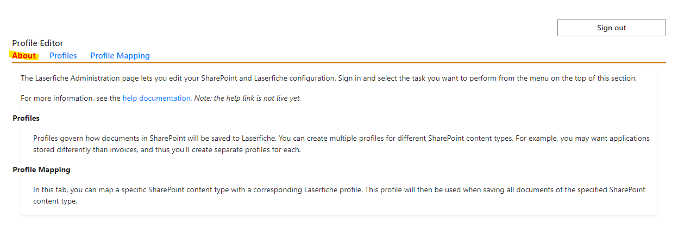
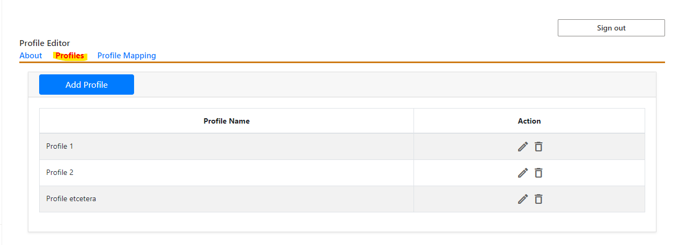

# Configuring Metadata Mappings

## PRE-RELEASE DOCUMENTATION - SUBJECT TO CHANGE

### Prerequisites
- be a Site Owner of the SharePoint Site for which the integration will be configured

## Overview
The integration is configured through the Admin Configuration web part. If you skip configuration and try to save to Laserfiche, you will see this error message:

The admin configuration web part allows you to specify a destination folder and a [Laserfiche Template](https://doc.laserfiche.com/laserfiche.documentation/en-us/Content/Fields_and_Templates.html) for each [SharePoint content type](https://support.microsoft.com/en-gb/office/introduction-to-content-types-and-content-type-publishing-e1277a2e-a1e8-4473-9126-91a0647766e5). This allows you to configure exactly how the metadata of a SharePoint content type should map to the fields of a Laserfiche Template. See below for specifics on how to configure the app in the web part.
### About View
Provides information about the Web Part.

### Profiles View
Displays the list of currently defined Profiles. Click on the “Add Profile” button to add a new profile. Click on the pencil icon to edit an existing profile, respectively. Both selections will open the Profile Editor View.

### Profile Editor View
- Name: this is the identifier used to associate SharePoint content types with this profile in the Profile Mapping tab.
- Laserfiche Template: If a profile is assigned a template, then all files saved to Laserfiche through that profile will be assigned that template in Laserfiche. [Learn more about templates](https://doc.laserfiche.com/laserfiche.documentation/en-us/Content/Fields_and_Templates.html).
- Laserfiche Destination: This option specifies the path to the folder in the Laserfiche Repository where the files associated with this profile will be saved.
- After Import: This option specifies what to do with the
SharePoint file after exporting it to Laserfiche.

- Mappings from SharePoint Column to Laserfiche Field Values
    - This is where the actual metadata transfer is configured.
    - Each Field in the template can be assigned a SharePoint column, so that when files are exported from SharePoint to Laserfiche, the file in Laserfiche will have a field with the same value as the Column of the file in SharePoint.
    - templates with required fields MUST have columns assigned to them.
    - The association between SharePoint columns and Laserfiche fields should be one-to-one, i.e., you should not attempt to map multiple SharePoint columns to the same Laserfiche field.

### Profiles Mapping View
Displays a list of SharePoint Content Types and their corresponding Laserfiche Profile. If you add a content type/profile pair, then
any SharePoint content matching that type will be assigned the corresponding profile when you attempt to save the content to Laserfiche.

### Default Profile
- If you try to save a file to Laserfiche and its SharePoint Content Type is not mapped to any Profile, you will see the error message at the top of the Page. To avoid creating a profile for every possible content type, you can set a default mapping as shown below.

