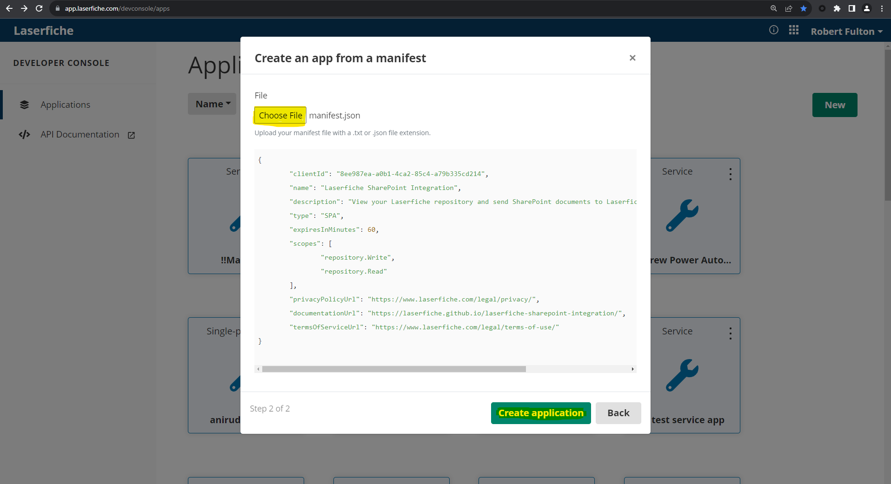

# Register App in Laserfiche
## PRE-RELEASE DOCUMENTATION - SUBJECT TO CHANGE
### Prerequisites
  - Have developer rights in your Laserfiche account.

### Steps
1. Open the [Developer Console](https://developer.laserfiche.com/developer-console.html).

1. Attempt to Create a New App from Manifest, and upload the manifest provided [here](../assets/manifest.json).

1. If the attempt fails because an app with that client ID already exists, find the app with that client id by opening [this url](https://app.laserfiche.com/devconsole/apps/8ee987ea-a0b1-4ca2-85c4-a79b335cd214/config) in a new tab.

1. One way or another, an app with that client ID should now exist. Open the app and switch from the general tab to the authentication tab.

1. Add the URLs of your three SharePoint Pages with the Laserfiche web part as new redirect URIs.
1. You should now be able to sign in on each of the components.
